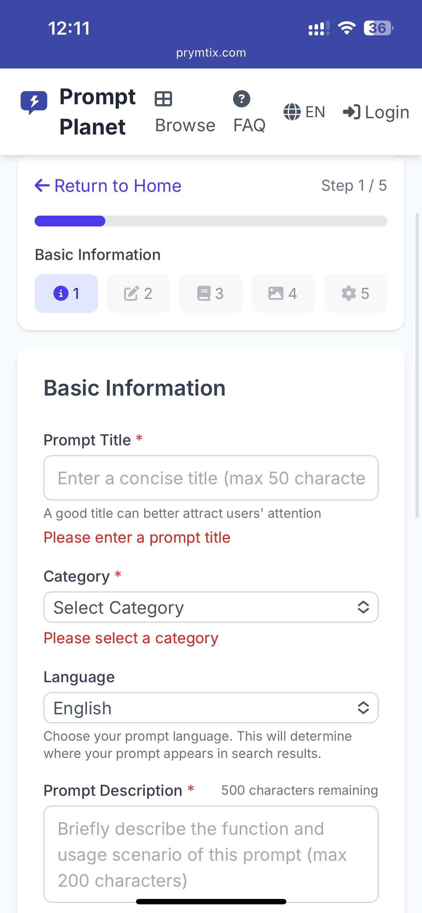

# Prompt Planet

<p align="center">
  
</p>

<div align="center">

[English](./README.md) | [中文](./README.zh-CN.md)

[](https://github.com/StevenQi7/Prompt-Planet/stargazers)
[](https://github.com/StevenQi7/Prompt-Planet/blob/main/LICENSE)
[](https://github.com/StevenQi7/Prompt-Planet)
[](https://prymtix.com)

</div>

## 🤖 100% AI Generated Project

Prompt Planet is a revolutionary project that showcases the power of AI in software development. **Every single line of code, documentation, and design decision in this project was generated by AI**, demonstrating the incredible capabilities of modern AI systems in creating full-scale applications.

🌐 **Live Demo**: [https://prymtix.com](https://prymtix.com)

## 📸 Screenshots

<div align="center">

### Home Page

*Clean and modern homepage design with featured prompts*

### Prompt Creation

*Multi-step prompt creation wizard with real-time preview*

### Browse & Discovery

*Category-based navigation and prompt discovery*

### User Dashboard

*Personal dashboard with prompt management*

### Mobile Experience
<div style="display: flex; justify-content: center; gap: 20px;">
  
  
</div>
*Responsive design optimized for mobile devices*

</div>

## 🌟 Key Features

- **Prompt Creation & Management**
  - Multi-step creation wizard (5 steps)
  - Basic info form with title and description
  - Markdown editor for prompt content
  - Image upload with preview (multiple images supported)
  - Category selection with visual indicators
  - Tag system with 5 tags limit
  - Auto-save draft functionality
  - Preview before publishing
  - Language selection (English/Chinese)

- **Browse & Discovery**
  - Category-based navigation
  - Featured prompts section
  - Popular tags display
  - Testimonials showcase
  - Responsive grid layout
  - Quick copy functionality

- **User System**
  - Email-based authentication
  - Personal dashboard
  - Prompt collection management
  - Usage tracking
  - Language preference settings

- **Performance & UX**
  - Client-side form validation
  - Smooth step navigation
  - Toast notifications
  - Responsive design
  - Loading states
  - Error handling
  - Scroll management

- **SEO & Accessibility**
  - Next.js App Router with built-in SEO support
  - Dynamic meta tags generation
  - Structured data for rich snippets
  - Semantic HTML structure
  - Optimized meta descriptions
  - Automatic sitemap generation
  - Social media preview cards
  - Multi-language SEO support

## 🛠️ Technology Stack

- **Frontend**
  - Next.js 15 with App Router
  - React 18 with Server Components
  - Tailwind CSS 4
  - React Query for data fetching
  - React Hook Form for form handling
  - Zustand for state management

- **Backend & Database**
  - Supabase for backend services
  - PostgreSQL with Row Level Security
  - Real-time subscriptions
  - Edge Functions

- **Storage & CDN**
  - Cloudflare R2 for object storage
  - Cloudflare CDN for global delivery
  - Image optimization and processing

- **Caching & Performance**
  - React Query caching
  - Next.js static and dynamic caching
  - Incremental Static Regeneration (ISR)
  - Service Worker for offline support
  - Edge caching with Cloudflare
  - Redis for server-side caching (coming soon)

- **Development & Deployment**
  - TypeScript for type safety
  - ESLint and Prettier for code quality
  - GitHub Actions for CI/CD
  - Vercel for deployment
  - Environment isolation

## 🚀 Getting Started

### Online Usage

Visit [https://prymtix.com](https://prymtix.com) to use the application directly.

### Local Development

#### Prerequisites

- Node.js 18.x or higher
- npm or yarn
- Supabase account
- Cloudflare R2 bucket

### Installation

```bash
# Clone the repository
git clone https://github.com/StevenQi7/Prompt-Planet.git

# Install dependencies
cd Prompt-Planet
npm install

# Set up environment variables
cp .env.example .env.local

# Start development server
npm run dev
```

Visit [http://localhost:3000](http://localhost:3000) to view the application.

## 📖 Documentation

- [Feature Documentation](./design/features.md)
- [API Documentation](./docs/api/README.md)
- [Development Guide](./docs/guide/development.md)
- [Deployment Guide](./docs/guide/deployment.md)
- [Changelog](./CHANGELOG.md)
- [Contributing Guidelines](./CONTRIBUTING.md)

## 🤝 Contributing

We welcome contributions! Please read our [Contributing Guidelines](./CONTRIBUTING.md) before submitting any changes.

## 📞 Contact

- GitHub Issues: [Create an issue](https://github.com/StevenQi7/Prompt-Planet/issues)
- Email: strani@163.com

## 📄 License

This project is licensed under the MIT License - see the [LICENSE](./LICENSE) file for details.

---

<div align="center">

**Powered by AI - From Code to Documentation**

</div>
