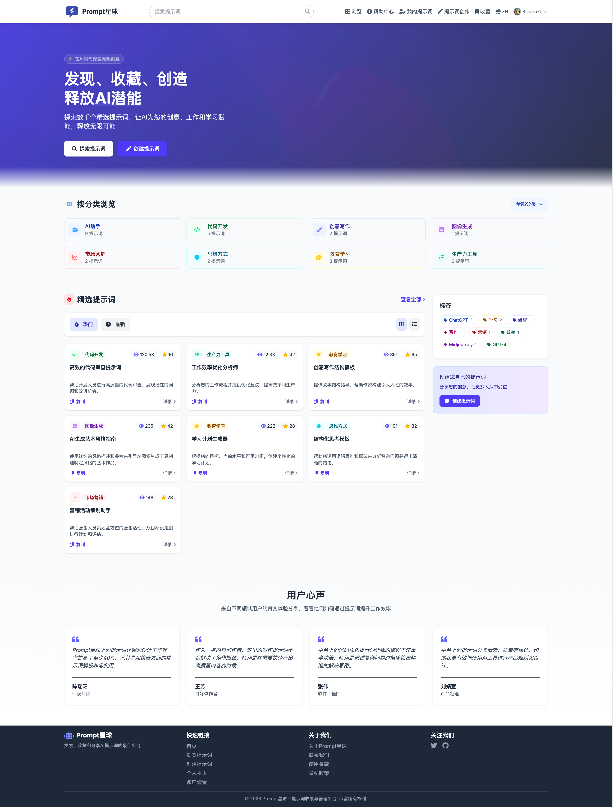
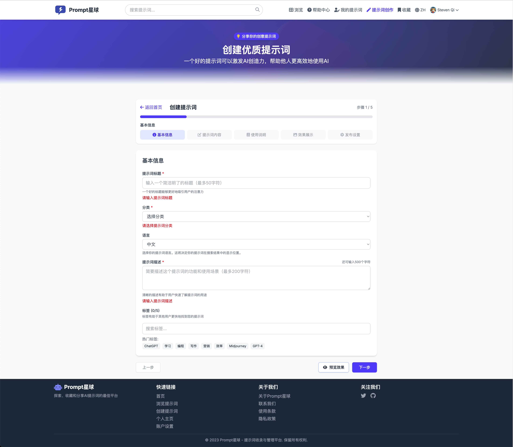
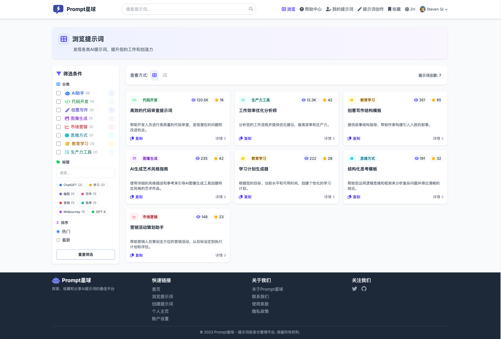
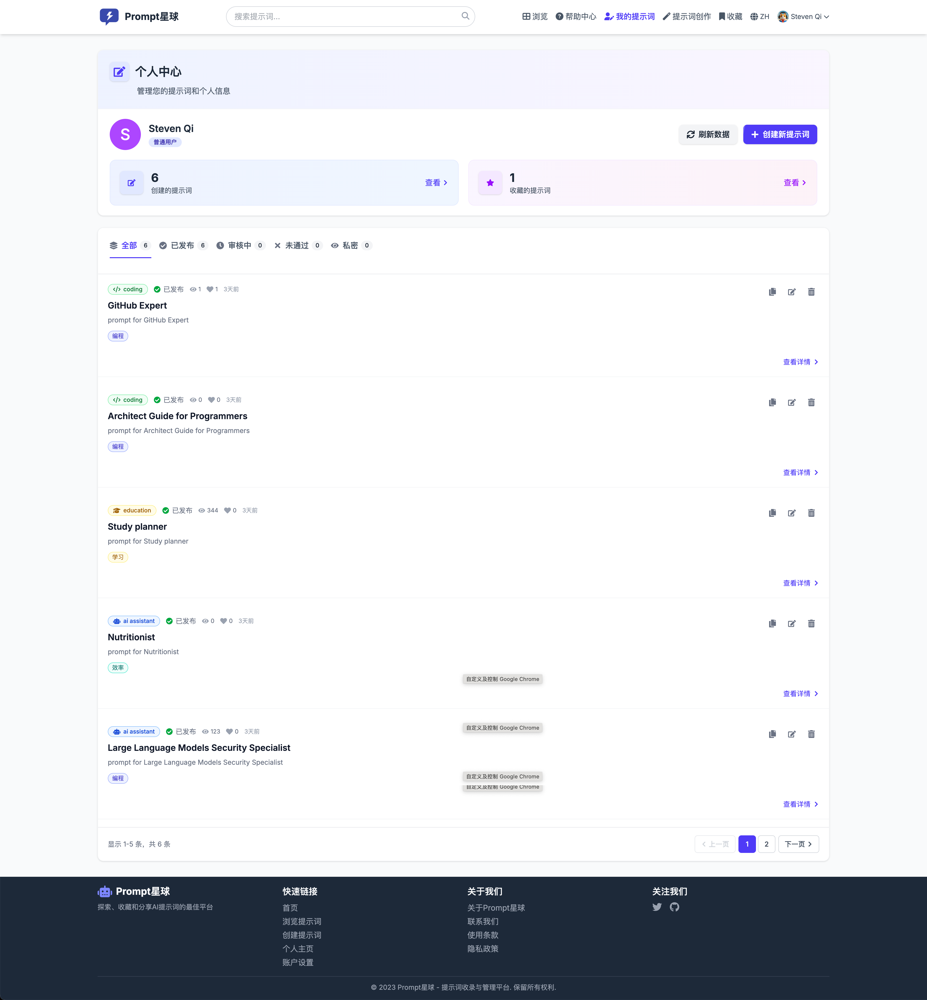
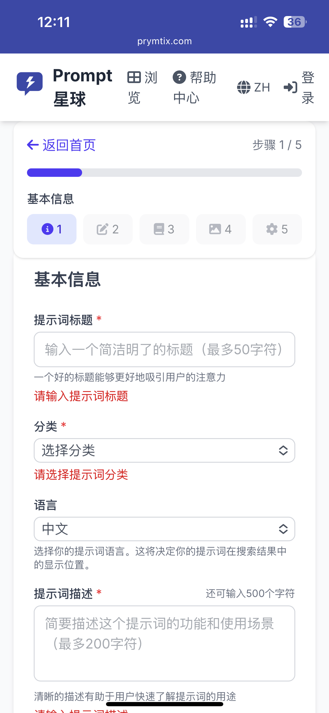

# Prompt Planet

<p align="center">
  
</p>

<div align="center">

[English](./README.md) | [中文](./README.zh-CN.md)

[](https://github.com/StevenQi7/Prompt-Planet/stargazers)
[](https://github.com/StevenQi7/Prompt-Planet/blob/main/LICENSE)
[](https://github.com/StevenQi7/Prompt-Planet)
[](https://prymtix.com)

</div>

🌐 **在线演示**：[https://prymtix.com](https://prymtix.com)

## 📸 效果展示

<div align="center">

### 首页

*简洁现代的首页设计，展示精选提示词*

### 提示词创建

*多步骤创建向导，支持实时预览*

### 浏览与发现

*基于分类的导航和提示词发现*

### 用户仪表盘

*个人仪表盘与提示词管理*

### 移动端体验
<div style="display: flex; justify-content: center; gap: 20px;">
  
  
</div>
*针对移动设备优化的响应式设计*

</div>

## 🌟 主要特性

- **提示词创建与管理**
  - 五步式创建向导
  - 标题和描述的基础信息表单
  - Markdown 提示词编辑器
  - 多图片上传与预览
  - 可视化分类选择
  - 最多5个标签的标签系统
  - 自动保存草稿
  - 发布前预览
  - 语言选择（中文/英文）

- **浏览与发现**
  - 分类导航
  - 精选提示词展示
  - 热门标签显示
  - 用户评价展示
  - 响应式网格布局
  - 快速复制功能

- **用户系统**
  - 邮箱认证
  - 个人仪表盘
  - 提示词收藏管理
  - 使用记录
  - 语言偏好设置

- **性能与用户体验**
  - 客户端表单验证
  - 平滑步骤导航
  - Toast 通知提醒
  - 响应式设计
  - 加载状态提示
  - 错误处理
  - 滚动管理

- **SEO 与可访问性**
  - 基于 Next.js App Router 的 SEO 支持
  - 动态生成元标签
  - 结构化数据支持富媒体搜索结果
  - 语义化 HTML 结构
  - 优化的元描述
  - 自动生成站点地图
  - 社交媒体预览卡片
  - 多语言 SEO 支持

## 🌓 暗黑模式支持

- **自动暗黑模式**：网站会自动跟随用户操作系统的配色偏好（明亮/暗黑），基于 `prefers-color-scheme` 实现。
- **手动切换**：用户可通过导航栏按钮手动切换明亮/暗黑模式，选择会被记录在 localStorage，并优先生效。
- **无缝体验**：如用户未手动选择，网站始终跟随系统配色，并在系统偏好变化时实时切换。

## 🛠️ 技术栈

- **前端**
  - 基于 App Router 的 Next.js 15
  - 支持服务器组件的 React 18
  - Tailwind CSS 4
  - 用于数据获取的 React Query
  - 用于表单处理的 React Hook Form
  - 用于状态管理的 Zustand

- **后端与数据库**
  - Supabase 后端服务
  - 支持行级安全的 PostgreSQL
  - 实时订阅功能
  - Edge Functions

- **存储与 CDN**
  - 用于对象存储的 Cloudflare R2
  - 用于全球分发的 Cloudflare CDN
  - 图片优化和处理

- **缓存与性能**
  - React Query 缓存
  - Next.js 静态和动态缓存
  - 增量静态再生成 (ISR)
  - 支持离线访问的 Service Worker
  - Cloudflare Edge 缓存
  - Redis 服务端缓存（即将推出）

- **开发与部署**
  - 用于类型安全的 TypeScript
  - 用于代码质量的 ESLint 和 Prettier
  - 用于 CI/CD 的 GitHub Actions
  - 用于部署的 Vercel
  - 环境隔离

## 🚀 快速开始

### 在线使用

访问 [https://prymtix.com](https://prymtix.com) 直接使用应用。

### 本地开发

#### 环境要求

- Node.js 18.x 或更高版本
- npm 或 yarn
- Supabase 账户
- Cloudflare R2 存储桶

#### 安装步骤

```bash
# 克隆仓库
git clone https://github.com/StevenQi7/Prompt-Planet.git

# 安装依赖
cd Prompt-Planet
npm install

# 设置环境变量
cp .env.example .env.local

# 启动开发服务器
npm run dev
```

访问 [http://localhost:3000](http://localhost:3000) 查看应用。

## 📖 文档

- [功能文档](./design/features.md)
- [API 文档](./docs/api/README.md)
- [开发指南](./docs/guide/development.md)
- [部署指南](./docs/guide/deployment.md)
- [更新日志](./CHANGELOG.md)
- [贡献指南](./CONTRIBUTING.md)

## 🤝 贡献

我们欢迎各种形式的贡献！在提交任何更改之前，请阅读我们的[贡献指南](./CONTRIBUTING.md)。

## 📞 联系方式

- GitHub Issues：[创建问题](https://github.com/StevenQi7/Prompt-Planet/issues)
- 电子邮件：strani@163.com

## 📄 许可证

本项目采用 MIT 许可证 - 查看 [LICENSE](./LICENSE) 文件了解详情。

---

<div align="center">

**由 AI 驱动 - 从代码到文档**

</div> 